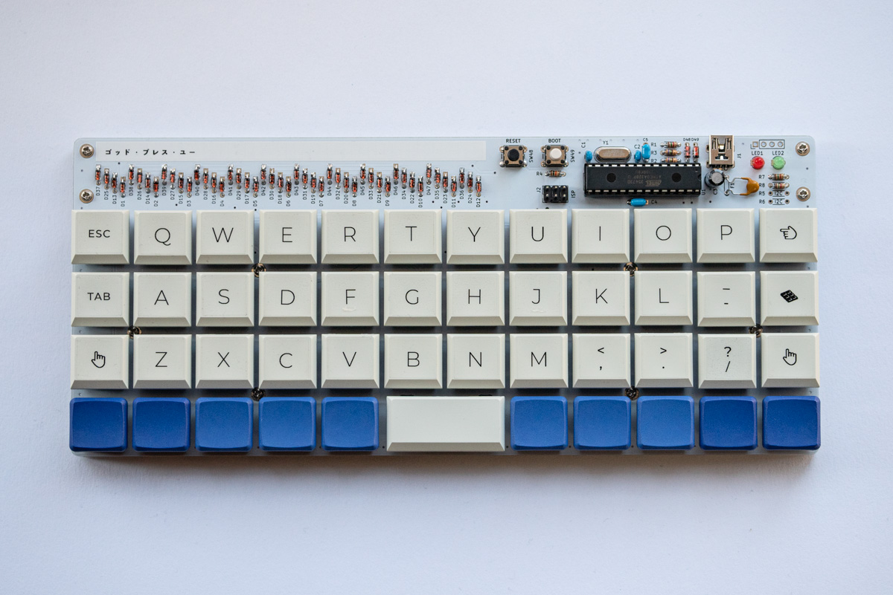

Plaid 🍫 Kailh Choc v1 ver.
===============

※This one has a tepra on it instead of a silkscreen.

The 4x12 ortholinear keyboard kit made by through hole components only. 

This includes some changes by heutronica.

- Uses Kailh Choc v1 instead of Cherry MX.
- Only MIT layout supported.

Atmega328p with VUSB on [QMK firmware](https://github.com/qmk/qmk_firmware).

[Build guide and bom is here](./doc)
[ビルドガイドとパーツリストはこちら](./doc)